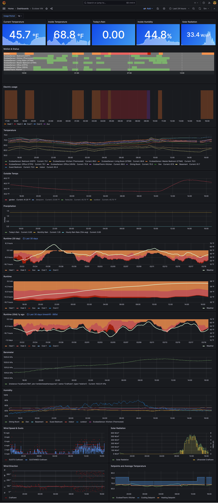

# ecobeemetrics

This project queries the ecobee api using the lovely github.com/rspier/go-ecobee package,
inserting into VictoriaMetrics or InfluxDB.

I use it to power a grafana dashboard monitoring my home.

## Setup

1. [Become a developer](https://www.ecobee.com/en-us/developers/), if you have not already.
2. Create an Ecobee API Application ID (API key) by going to the
   [consumer portal](https://www.ecobee.com/consumerportal/index.html),
   clicking the "Developer" option in the menu, and clicking the "Create New" button.
   Use the `ecobee PIN` authorization method.
3. Get the example application and location configs:

   curl https://raw.githubusercontent.com/tedpearson/ecobeemetrics/master/ecobeemetrics.example.yaml > ecobeemetrics.yaml

4. Modify the configs with your own values for:
   - influxdb/victoriametrics connection
   - measurement names for metrics from the sensors and the thermostat
   - your thermostat id (serial number)
     - You can find it on the About page of the
        [Ecobee portal](https://www.ecobee.com/consumerportal/index.html).
   - your app id (api key)
     - You can find it on the Developer page of the Ecobee portal after having created your application.
   - a location to keep your auth information
   - a cron schedule for how often to poll ecobee's api
5. Run `ecobeemetrics --getpin --config ecobeemetrics.yaml`. Assuming your config is correct, you will get this output:

   Ecobee PIN: XXXX-XXXX
   Ecobee code: xxxxxxxxxxxxxxxxxxxx

6. Go to the Ecobee portal > My Apps and click "Add Application". Enter the PIN from the previous
   step and click Validate.
7. Run `ecobeemetrics --savetoken ecobee_code_here --config ecobeemetrics.yaml` with the Ecobee code from above.
8. You are all set and can now run Ecobeemetrics via `ecobeemetrics --config ecobeemetrics.yaml`.

## Exported Metrics

- thermostat (measurement name):
  - name (label)
  - cooling_setpoint
  - heating_setpoint
  - program (string field, doesn't work in victoriametrics)
  - equpiment_status (string field, doesn't work in victoriametrics)
  - heat_1
  - heat_2
  - heat_3
  - cool_1
  - cool_2
  - aux_heat_1
  - aux_heat_2
  - aux_heat_3
  - fan
  - idle
- sensor (measurement name) (includes sensor data from thermostat as well as remote sensors):
  - name (label)
  - temperature
  - occupancy
  - humidity

## Dashboard

My personal dashboard includes the ecobee metrics intermixed with data from my Ambient Weather station.
I'm [including the config](dashboard.json) and some screenshots (below) to give an idea of what's possible.

Note that this dashboard uses a VictoriaMetrics data source.

Feel free to check out my other projects that help populate this dashboard:
  - [ambientweatherexporter](https://github.com/tedpearson/ambientweatherexporter),
    for exporting weather from Ambient Weather stations to influx/Victoriametrics
  - [electric-usage-downloader](https://github.com/tedpearson/electric-usage-downloader),
    for downloading electric usage from my local utility, NOVEC, and exporting to
    influx/VictoriaMetrics.

Panels on the below dashboard that are populated by Ecobeemetrics:
- Singlestats:
  - Inside Temperature
  - Inside Humidity
- Motion & Status
- Temperature (also has ambient weather station data)
- Runtime panels (also has ambient weather station data)
- Humidity (also has ambient weather station data)
- Setpoints 

